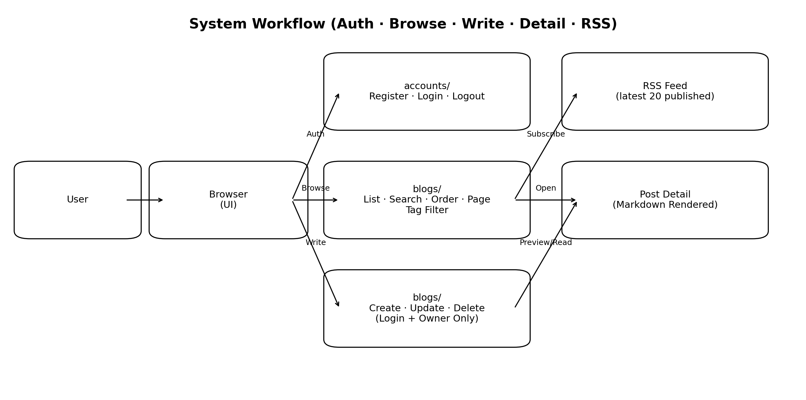
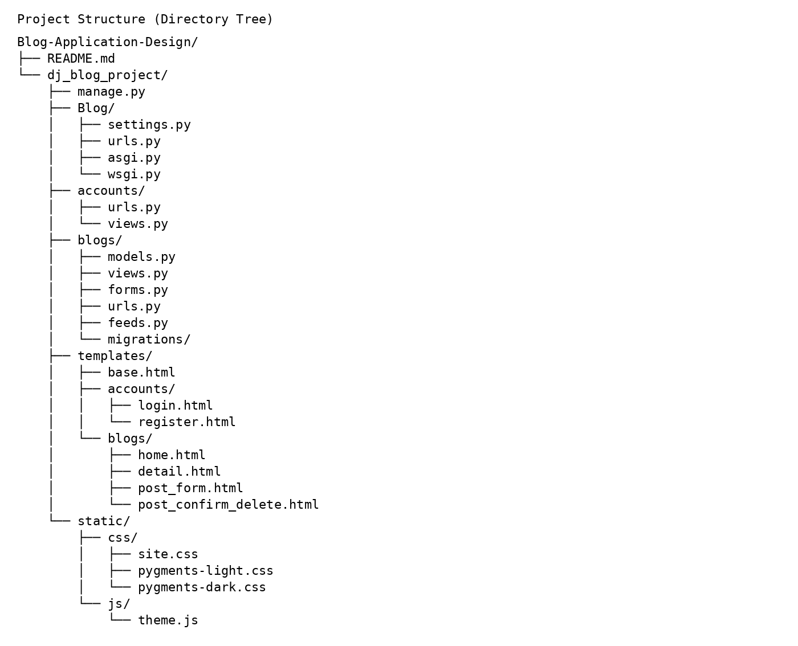
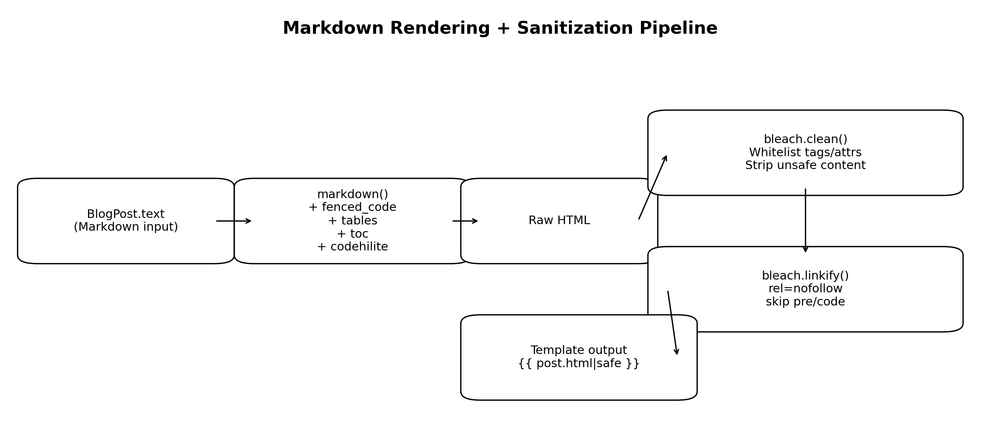

# Blog-Application-Design

一个基于 **Django** 的多用户博客系统原型（research-grade course project / engineering prototype）。系统围绕“**内容生产—组织—检索—分发**”的闭环，提供用户认证、文章发布与草稿管理、标签体系、搜索+排序+分页的组合查询、Markdown（含代码高亮）渲染与安全清洗、RSS 输出，以及深色/浅色主题切换等能力。

从研究视角，本项目更关注两个常被弱化的问题：  
1) **内容渲染的安全边界（Security Boundary for User-Generated Content）**：将 Markdown 视为不可信输入，采用“渲染 → 白名单清洗 → 安全输出”的可审计流水线，降低 XSS 等前端攻击面。  
2) **检索参数的组合复杂度（Compositional Query Semantics）**：在真实 UI 中，搜索、排序、分页、标签过滤往往叠加出现；项目将 QueryString 状态保持抽象为可复用模块，减少模板逻辑爆炸并增强可维护性。

---

## System Workflow（工作流程图）

<p align="center">
  
</p>

---

## Project Structure（项目文件目录图）

<p align="center">
  
</p>

---

## Markdown Rendering + Sanitization（Markdown 渲染与安全清洗流程）

<p align="center">
  
</p>

---

## Key Contributions（研究/工程贡献点）

本项目不止实现“能跑的 CRUD”，而是显式实现并固化了可复用的工程抽象：

- **可审计的 UGC 安全渲染管线**：Markdown → HTML → Bleach 白名单清洗 → 链接处理（nofollow/跳过 code block）→ 模板安全输出，从机制上收敛可执行面，便于安全审计与扩展。
- **组合检索语义的工程化实现**：在列表页将搜索/排序/分页/标签过滤视为一个组合系统，利用统一的 QueryString 管理实现状态保持与一致性导航。
- **可解释的阅读指标建模**：对中英混合文本估计字/词数与阅读时长，并在 UI 层稳定呈现，为后续推荐系统特征工程预留接口。
- **面向分发的 RSS 设计**：以摘要而非全文作为 feed item 描述，兼顾订阅体验与信息暴露控制。

---

## Features

- 用户系统：注册 / 登录 / 登出（基于 Django authentication 机制）
- 文章：创建 / 编辑 / 删除（仅作者可操作），支持草稿（`is_published`）
- 标签：逗号输入自动去重、自动创建 Tag，并用 slug 做可读 URL
- 列表检索：搜索（标题/正文）、最新/最旧排序切换、分页；参数可组合且不丢失
- 内容渲染：Markdown → HTML → Bleach 白名单清洗 → 安全输出；支持代码高亮（Pygments CSS）
- RSS：输出最近 20 篇已发布文章，item 描述为摘要
- UI：Bootstrap + 深色/浅色主题切换（localStorage 持久化，支持跟随系统偏好）

---

## Reproducibility（环境与可复现性）

建议环境：
- Python 3.13
- Django
- 依赖：`markdown`、`bleach`、`Pygments`

推荐在仓库根目录提供 `requirements.txt`（示例）：

```txt
Django>=6.0
markdown
bleach
Pygments
